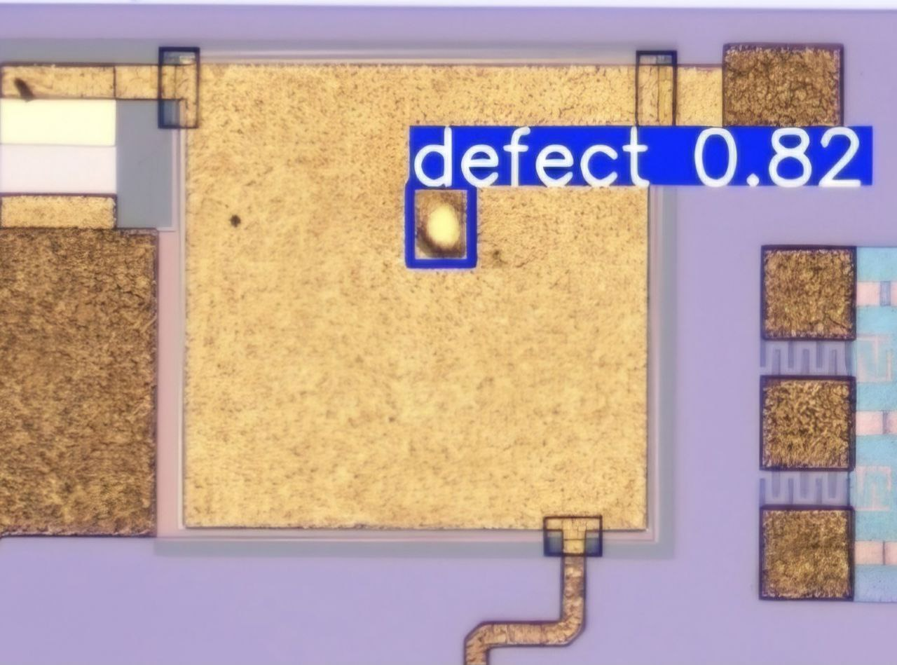
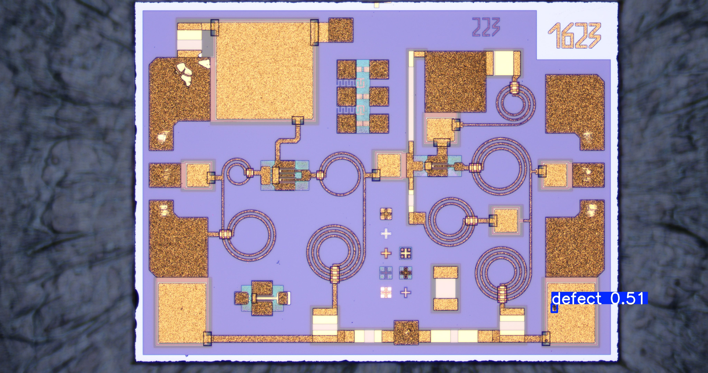
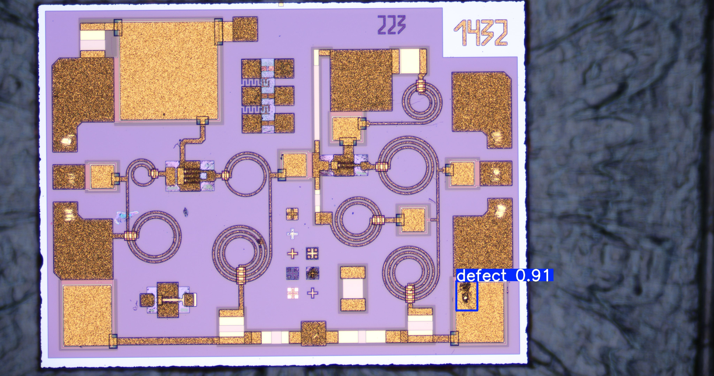
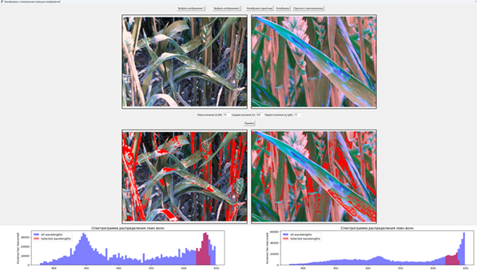
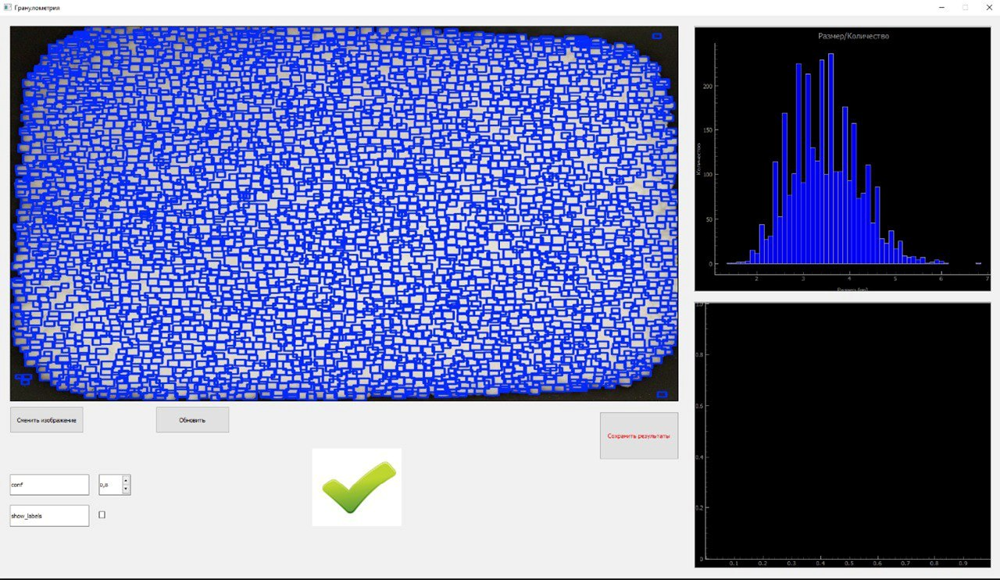
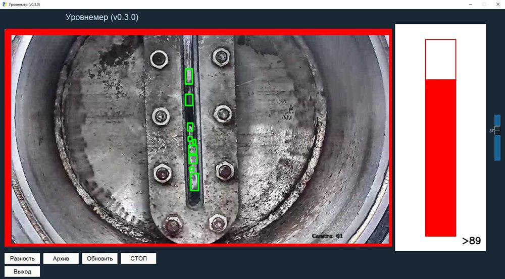

# Computer Vision Engineer

Computer Vision Engineer focused on industrial AI systems for real-world applications in manufacturing and process monitoring.

Specialized in designing and deploying real-time computer vision pipelines using classical CV (OpenCV) and deep learning models (YOLO, U-Net), with emphasis on edge deployment and performance optimization.

Experienced in NVIDIA Jetson platforms (Nano, Xavier, Orin) and industrial camera systems (GigE Vision).

## 🧠 Core Expertise

- Industrial Computer Vision Systems
- Real-time Video Processing Pipelines
- Object Detection & Segmentation (YOLO, U-Net)
- Edge AI Deployment (NVIDIA Jetson)
- Camera Calibration & Measurement Systems
- Image Processing (OpenCV)

## 🚀 Selected Projects

### Microchip Defect Detection (AOI System)

Automated optical inspection system for detecting microchip defects in high-resolution (2K) microscope images.

- Designed a two-stage YOLOv11 pipeline (ROI extraction + defect detection)
- Implemented OpenCV preprocessing for noise reduction and normalization
- Reduced computational load via ROI-based inference strategy
- Annotated and augmented dataset (1,500 → 2,500 images) using CVAT
- Exported results to structured CSV reports for industrial analysis
- Awarded the “Student Startup” grant

### Fusarium Detection in Wheat (Spectral Analysis)

Computer vision system for detecting Fusarium infection in wheat using spectral image analysis.

- Developed RGB-to-HSV transformation for spectral feature extraction
- Built mathematical model mapping HSV Hue to wavelength (380–740 nm)
- Analyzed spectral differences between healthy and infected plants
- Designed wavelength-based disease detection approach
- Awarded research grant by Novgorod Innovation Development Center

### Granulometry Monitoring System

Real-time industrial system for detecting, counting, and measuring granules (~5 mm) on a production conveyor.

- YOLO-based detection pipeline for real-time inference
- Estimated real-world object size using camera calibration and projection geometry
- Integrated GigE Vision industrial camera system
- Exported model to ONNX for optimized inference performance
- Implemented real-time alert system (visual + audio signals)
- Logged measurements into structured reporting system

### Boiling Layer Level Monitoring System

Real-time computer vision system for monitoring boiling layer level in industrial tanks.

- OpenCV-based pipeline for boundary detection in noisy environments
- Extracted upper boundary position in real time from video stream
- Converted pixel coordinates to real-world measurements using calibration
- Implemented threshold-based anomaly detection system
- Integrated into unified multi-system industrial monitoring interface

## ⚙️ Technologies

**Programming:** Python, C, C++  
**Computer Vision:** OpenCV, YOLO, U-Net  
**Deep Learning:** PyTorch  
**Deployment:** NVIDIA Jetson (Nano / Xavier / Orin), ONNX  
**Tools:** CVAT, Git, Linux, GigE Vision

---

## 📫 Contact

Email: rysevlad@gmail.com
